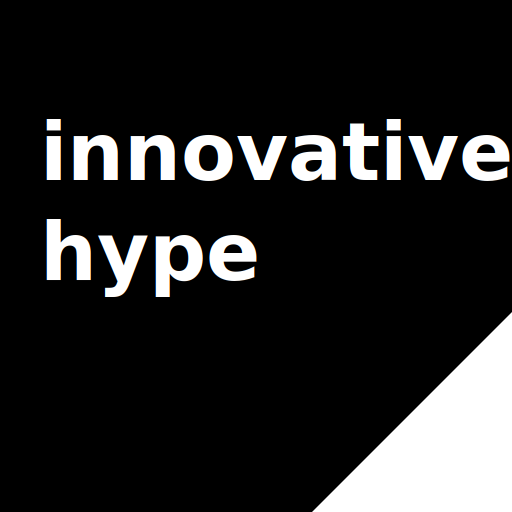

<p align="center">
  <a href="https://chat.innovativehype.com">
    
  </a>
  <h1 align="center">
    <a href="https://chat.innovativehype.com">InnovativeHypeChat</a>
  </h1>
</p>

<p align="center">
  <strong>Based on <a href="https://librechat.ai">LibreChat</a></strong>
</p>

# InnovativeHypeChat

InnovativeHypeChat is a customized AI chat application based on LibreChat, focused on providing free AI models through OpenRouter and document search capabilities through Ollama RAG.

## 🚀 Quick Start

### Prerequisites

- [Docker](https://docs.docker.com/get-docker/) and [Docker Compose](https://docs.docker.com/compose/install/)
- (Optional) An [OpenRouter](https://openrouter.ai/) API key is not needed to access free models. Add an API key to access OpenRouter's paid models

### Installation

1. **Clone the repository**
   ```bash
   git clone https://github.com/micahp/InnovativeHypeChat.git
   cd InnovativeHypeChat
   ```

2. **Create a .env file**
   ```bash
   cp .env.example .env
   ```
   
3. **(Optional) Update your .env file with your OpenRouter API key**
   ```
   OPENROUTER_API_KEY=your_api_key_here
   ```

4. **Start the application**
   ```bash
   docker compose up -d
   ```

5. **Download Ollama models for RAG**
   ```bash
   ./setup-ollama-models.sh
   ```

6. **Access the application**
   
   Open your browser and navigate to [http://localhost:3080](http://localhost:3080)

## 🔧 Building Your Own Docker Image

If you want to build and use your own Docker image:

1. **Update the Docker Hub username in build-and-push.sh**
   ```bash
   nano build-and-push.sh
   ```

2. **Make the build script executable**
   ```bash
   chmod +x build-and-push.sh
   ```

3. **Build and push your Docker image**
   ```bash
   ./build-and-push.sh
   ```

4. **Update docker-compose.override.yml with your Docker image**
   ```bash
   nano docker-compose.override.yml
   ```

## 🌟 Features

InnovativeHypeChat includes all the powerful features of LibreChat plus:

- 🔍 **Free AI Models**: Access to free models through OpenRouter
- 📄 **Document Search**: RAG capabilities through Ollama
- 🧠 **Local Processing**: Uses Ollama for local model inference
- 🚀 **Custom Branding**: Fully customized interface

---

# ✨ LibreChat Features

InnovativeHypeChat is based on LibreChat and inherits all of its amazing features:

- 🖥️ **UI & Experience** inspired by ChatGPT with enhanced design and features

- 🤖 **AI Model Selection**:  
  - Anthropic (Claude), AWS Bedrock, OpenAI, Azure OpenAI, Google, Vertex AI, OpenAI Assistants API (incl. Azure)
  - Custom Endpoints: Use any OpenAI-compatible API, no proxy required
  - Compatible with Local & Remote AI Providers

- 🔧 **Code Interpreter API**: 
  - Secure, Sandboxed Execution in Python, Node.js (JS/TS), Go, C/C++, Java, PHP, Rust, and Fortran
  - Seamless File Handling: Upload, process, and download files directly

- 🔦 **Agents & Tools Integration**:  
  - LibreChat Agents and Custom Assistants
  - Model Context Protocol (MCP) Support for Tools

- 🪄 **Generative UI with Code Artifacts**:  
  - Creation of React, HTML, and Mermaid diagrams directly in chat

- 🎨 **Image Generation & Editing**
  - Text-to-image and image-to-image capabilities

- 💾 **Presets & Context Management**:  
  - Create, Save, & Share Custom Presets  
  - Switch between AI Endpoints and Presets mid-chat

- 💬 **Multimodal & File Interactions**:  
  - Upload and analyze images with various AI models
  - Chat with Files using multiple AI providers

- 🌎 **Multilingual UI**:  
  - Support for multiple languages

- 🔍 **Search & Discovery**:  
  - Search all messages/conversations

- 👥 **Multi-User & Secure Access**:
  - Multi-User, Secure Authentication with OAuth2, LDAP, & Email Login Support

For a complete list of features, visit the [LibreChat documentation](https://docs.librechat.ai/).

<p align="center">
  <a href="https://discord.librechat.ai"> 
    
  </a>
  <a href="https://www.youtube.com/@LibreChat"> 
    
  </a>
  <a href="https://docs.librechat.ai"> 
    
  </a>
  <a aria-label="Sponsors" href="https://github.com/sponsors/danny-avila">
    
  </a>
</p>

<p align="center">
<a href="https://railway.app/template/b5k2mn?referralCode=HI9hWz">
  
</a>
<a href="https://zeabur.com/templates/0X2ZY8">
  
</a>
<a href="https://template.cloud.sealos.io/deploy?templateName=librechat">
  
</a>
</p>

<p align="center">
  <a href="https://www.librechat.ai/docs/translation">
    
  </a>
</p>
